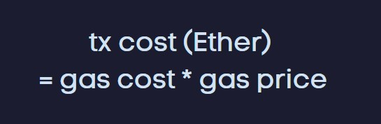

# Wallets
A wallet is software that manages addresses. This is different from the blockchain. It’s installed and controlled by the user. There are different kinds of wallets. We can have desktop applications, mobile applications, browser extensions, and physical wallets. 

The most popular wallet used for Ethereum is Metamask (a browser extension) and Nano Ledger(A physical wallet). 

The first function of a wallet is to generate addresses. Wallets will first randomly generate a private key then compute a public key and finally derive an Ethereum address. For most people, one address is not enough maybe you will use one Ethereum address for saving your ether and another for other operations, etc. Fortunately, a wallet can generate multiple Ethereum addresses. You might think the wallet will generate several private keys for that actually not. A single private key can generate multiple Ethereum addresses what they can do is called Hierarchical Deterministic Wallet(HD Wallet) pretty much all wallets are like this. If you take two Ethereum addresses it is impossible to identify if they come from the same private key. So that is good for your privacy. The creation of Ethereum addresses is decentralized. Anybody is able to generate as many addresses as they want but how do we guarantee two different people won’t generate the same address? It is actually technically possible. If two different wallets generate the same private keys. Then the same Ethereum addresses also be generated then one person will be able to steal the ether of another person. This is called an address collision. However, the likelihood of this happening is so low. You don’t really have to worry about it. If someone steals your private key he/she can steal your all ether. Physical wallets like Nano Ledger are useful in that regard. But they are less convenient to use.

# Transactions

A transaction is a signed package of data that describe an action that you want to take on the blockchain. You can have three kind of transactions. First you can send ether to another address. Second you can execute a smart contract. And third you can create a new smart contract. Let’s see what are the different fields of transactions:

First, we have the “from” field which is the address that sends and sign transactions. 

Then you have the “to” field that the recipient of the transactions. 

Then you have the “gas” and “gasPrice”. This includes how much are you willing to pay to the miners in order to include your transactions on the blockchain. 

Then you have the “value” field that you fill only if you want to send ether to someone else.

Then you have the date field. This is used if you want to call a function on the smart contract to describe which function you want to call and with which argument.

## Lifecycle of a transactions

First, your wallets build the transactions. So it’s gonna fill all the fields that were described before.

Then the wallet will sign the transaction using a private key associated with your addresses. 

Then the wallet will send the transactions to an Ethereum blockchain

The miner will begin the transaction and include it in the next block and this process takes about 15 seconds. 

One thing that doesn’t matter here is who delivers the transaction to the Ethereum network. Because if anybody tries to change the content of the transaction or modify the signature the Ethereum blockchain will pick up the fact that the transaction is invalid and is rejected. 

After a transaction is processed by the miner and included in the block you will begin to see the side effect of the transaction. So if you send some ether you will see some balance, if you executed the function of a smart contract you also be able to see some data. And you can actually inspect a transaction actually took place using a blockchain explorer and for Ethereum the most famous one is Etherscan.

# Smart Contract
A smart contract is a small program that runs on the Ethereum blockchain. Smart contracts have some properties that make them very different than other programs. 

## Pro : 
- Code is immutable 
- Censorship-resistant
- No need for a server
- Very safe
- Easy to transfer money

## Cons:
- Expensive
- Very slow. When you want to interact with the smart contract, you need to send a transaction, and for this transaction to be picked up by the miner and it takes an average of 15 seconds
- Limited capabilities
- No future scheduling - you cannot schedule a smart contract to run in the future
- Cannot call external API that is outside the blockchain.

## How smart contract works?

The smart contract has an Ethereum address with some code and data. And they run on the blockchain. First, you need to write the code of the smart contract for that you can use the programming language like solidity. Then you need to compile the code into the EVM Bytecode. The EVM is the part of Ethereum that run smart contract. The EVM doesn't know how to run solidity. It only knows how to run instructions. The EVM byte code is the series of these elementary instructions. So once you have compiled the smart contract and have the byte code. You need to create the smart contract on the blockchain. For that, you need to create the transactions with the EVM byte code and send them to the blockchain. The miner will keep the transactions and the smart contract will be created. After that, you can interact with the smart contract.

# Gas

When you send any transaction to the Ethereum blockchain, you need to pay transaction fees. That’s because we want to prevent spamming and we also want to reward miners for the effort. 

### Who pays what?
First the sender of the transaction. The sender term means the address that signs the transactions. It doesn't matter who delivers the transaction to the network could be the sender of the transaction or anybody else. 

### Who receives these transaction fees?

You can’t know this in advance but it will be the miner that successfully mines the block in which your transaction is included.

## How much you will pay?

For that, we need to understand gas➖

When you are on the smart contract, you run some elementary operations on the Ethereum Virtual Machine. Each of these operations is computationally intensive and we quantify this with gas and maybe saving some data that will be 20K gas or … . So we add the gas cost of all these operations and at the end, we have the total gas cost. Then we need to convert the gas cost into the ether because we gonna pay the transaction fee in ether, not in gas. Gas is just an abstract that we use to measure transaction fees but you can’t actually pay with gas. 

Through this conversion from gas to Ether, we need to know how much Ether you are willing to pay for each unit of gas. That’s what we called the gas price. And actually, it's up to you to put the gas price. If you put the lower gas price miners will not be interested and may ignore your transaction. If you put a normal gas price the transaction will be mined normally in 15 seconds. Or If you are really in hurry you can put a higher gas price and your transaction will be mined faster. 

Gas field of a transaction.
You have -
- gas
- gasPrice

For gas that’s the maximum price, you are willing to pay for your transactions. It is actually possible to simulate the transaction and have an estimate for the gas price and usually, wallets do this for you.